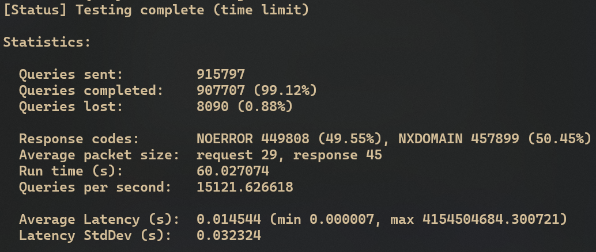

# DNS Proxy

<a href="#"></a>
<a href="#"></a>

A high-performance DNS proxy server implemented in C.

## Project Overview

This DNS proxy server is designed to provide high-performance DNS request handling with features such as blacklisting and request redirection. It uses libev for efficient event handling and uthash for fast hash table operations.

> [!CAUTION]
> This project depends on the following libraries:
>
> - libev
> - uthash

# Table of Contents

1. [Installing Dependencies](#installing-dependencies)
   - [On Linux](#on-linux)
   - [Nix OS/package manager](#nix-ospackage-manager)
   - [On macOS (using Homebrew)](#on-macos-using-homebrew)
2. [Workflow](#workflow)
3. [Configuring](#configuring)
4. [Building and Running](#building-and-running)
5. [Testing](#testing)
6. [Benchmark](#benchmark)
   - [Testing conditions](#testing)
   - [In virtual environment](#in-virtual-environment)
   - [On native Linux x86_64](#on-native-linux-x86_64)

### Installing Dependencies

#### On Linux:

```sh
sudo *your package manager* *update*
sudo *your package manager* libev-dev uthash-dev
```

uthash is a header-only library.
You can download it from [Troy D. Hanson's repository](https://github.com/troydhanson/uthash) if you want.

#### Nix\* OS/package manager:

```sh
nix-shell # includes libraries and dnsperf for testing
```

#### On macOS (using Homebrew):

```sh
brew install libev
brew install uthash
```

## Workflow

The following diagram illustrates the workflow of the DNS proxy:


## Configuring

> [!IMPORTANT]
> To configure DNS Proxy refer to [config.c](../src/config.c) and [config.h](../include/config.h)

Configuration includes:

- Blacklisted domain names
- Default response for query with blacklisted domain name
- Upstream DNS resolvers
- Redirection
- Proxy address & port
- Logger level (FATAL,ERROR,WARN,INFO,DEBUG,TRACE)
- Constants for:
  - Average/max sizes for: domain name, request, response.
  - DNS response codes.

## Building and Running

To build the project:

```sh
make -j($nproc)
```

To run the DNS proxy:

```sh
sudo ./dns-proxy # uses port 53
# or
./dns-proxy # uses fallback port 5353
```

## Testing

This project includes a test script which uses `dnsperf`, it is located at `assets/tests/test.sh`. Before running the test, you need to give it execution permission:

```sh
chmod +x assets/tests/test.sh
```

Then you can run the test:

```sh
cd assets/tests/
./test.sh
```

The project has been tested with dnsperf for performance evaluation.

## Benchmark

### Below is a benchmark result of the DNS proxy using`dnsperf`:

> [!IMPORTANT] > `NXDOMAIN` is a blacklisted response, can be configured to another response type

#### Testing conditions can be found in default config, but I'll duplicate them here:

#### `dnsperf` acting as 4 clients, 5 seconds query timeout, `REDIRECT` flag set to 0, sending queries to:

```plaintext
microsoft.com - blacklisted
google.com - blacklisted
youtube.com - blacklisted
github.com
torproject.org
facebook.com
```

#### Upstream resolvers used in test (all at once):

```plaintext
8.8.8.8
9.9.9.9
8.8.4.4
```

### In **_virtual environment_**, e.g. `WSL`:



### On **_native_** Linux x86_64


