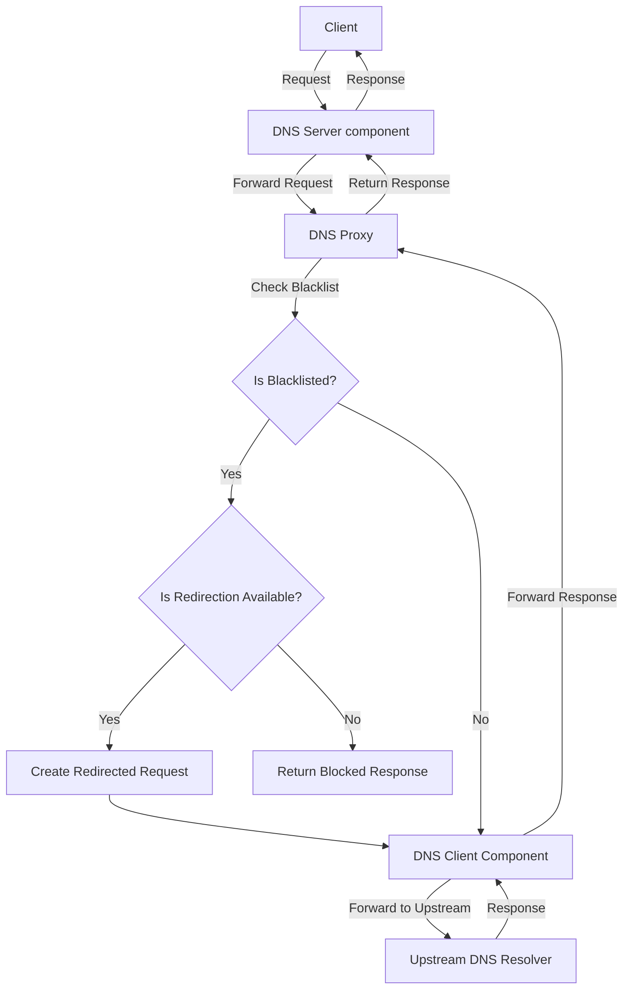
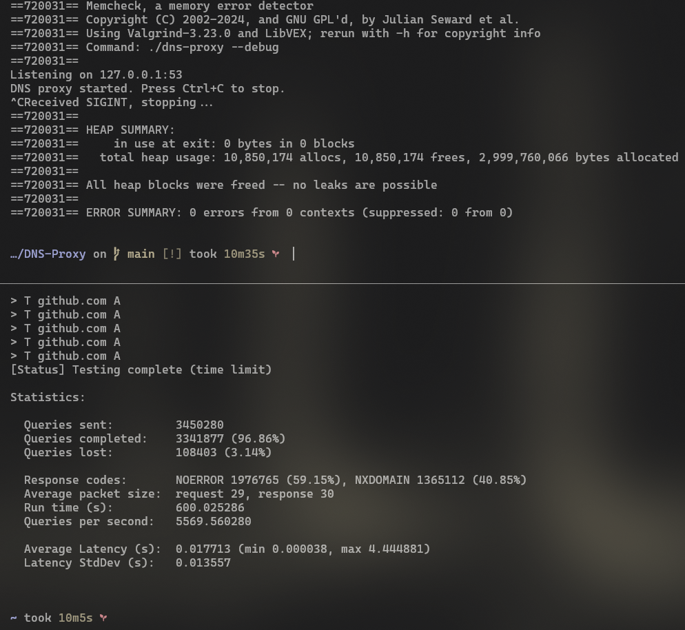

# DNS Proxy

<a href="#"></a>
<a href="#"></a>

A high-performance DNS proxy server implemented in C.
## Project Overview

This DNS proxy server is designed to provide high-performance DNS request handling with features such as blacklisting and request redirection. It uses libev for efficient event handling and uthash for fast hash table operations.

> [!CAUTION]
> This project depends on the following libraries:
> - libev
> - uthash

### Installing Dependencies

#### On Ubuntu/Debian:

```sh
sudo apt-get update
sudo apt-get install libev-dev uthash-dev
```

uthash is a header-only library. 
You can download it from [Troy D. Hanson's repository](https://github.com/troydhanson/uthash) if you want.

#### On macOS (using Homebrew):

```bash
brew install libev
brew install uthash
```

## Workflow

The following diagram illustrates the workflow of the DNS proxy:



## Building and Running

To build the project:

```sh
make -j($nproc)
```

> [!IMPORTANT]
> To configure DNS Proxy refer to config.c and include/config.h


To run the DNS proxy:

```sh
sudo ./dns-proxy
```

## Testing

This project includes a test script which uses `dnsperf`, it is located at `assets/tests/test.sh`. Before running the test, you need to give it execution permission:

```sh
chmod +x assets/tests/test.sh
```

Then you can run the test:

```sh
cd assets/tests/
./test.sh
```

The project has been tested with dnsperf for performance evaluation.

## Benchmark

### Below is a benchmark result of the DNS proxy using `valgrind` and `dnsperf`: 
> [!IMPORTANT] 
> `NXDOMAIN` is a blacklisted response, can be configured to another response type
>
> #### Testing conditions can be found in default config, but I'll duplicate them here: 
>
 > ##### `valgrind G_SLICE=always-malloc valgrind -s --leak-check=full --show-leak-kinds=all ./dns-proxy --debug `
 > #### `dnsperf` acting as 4 clients, using 4 threads, sending queries to: ###
>> ```plaintext
>> github.com
>> microsoft.com - blacklisted
>> google.com - blacklisted
>> youtube.com
>> torproject.org
> #### for 10 minutes with `REDIRECT` flag set to 0. ###
>
> #### Upstream resolvers used in test (all at once): ###
>> ```plaintext
>> 8.8.8.8
>> 1.1.1.1
>> 8.8.4.4
>>``` 


